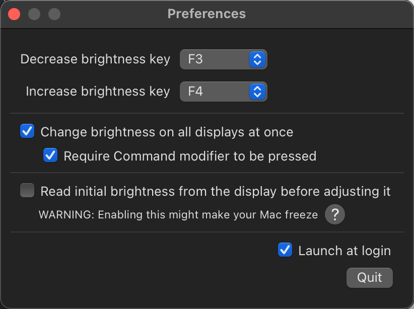
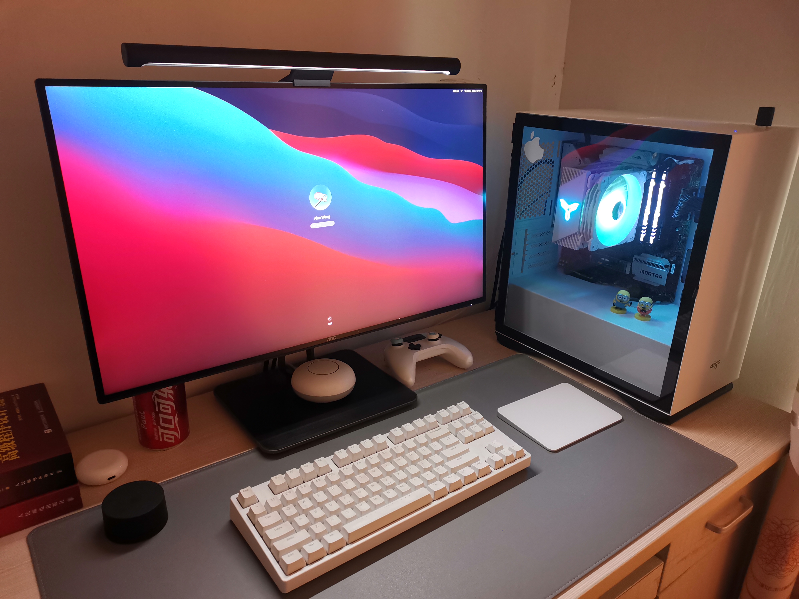

# Hackintosh-i5-10400-B460M-MORTAR-WIFI
[](https://GitHub.com/3Alan/Hackintosh-i5-10400-B460M-MORTAR-WIFI/releases/)
[](https://GitHub.com/3Alan/Hackintosh-i5-10400-B460M-MORTAR-WIFI/stargazers/)

## Monterey 版本
刚升级，正在试用，需要的前往[查看](https://github.com/3Alan/Hackintosh-i5-10400-B460M-MORTAR-WIFI/tree/main/Monterey)

## EFI 
因为我装的是双系统，所以EFI中有`windows`引导文件，使用前删除`Microsoft`文件夹

> 参考EFI及资料
> 
> https://mp.weixin.qq.com/s/UNtxsMIaKISyH6uRNt0LzQ
> 
> https://github.com/cheneyxx/Hackintosh-10400-B460M-MORTAR
> 
> https://www.bilibili.com/video/BV1Lf4y1i7FV?from=search&seid=15517732188143082051
> 
> https://github.com/OpenIntelWireless/IntelBluetoothFirmware
> 
> https://github.com/OpenIntelWireless/itlwm
> 
> https://github.com/xzhih/one-key-hidpi

macOS version: 11.3.1 Big Sur

镜像：黑果小兵11.3.1镜像

引导方式：OC引导（0.6.5）

## 硬件配置（价格仅供参考）
**购买时间：2021-6-1**
|硬件|型号|价格（京东）含购物券|
|------|------|------|
|主板|微星 B460M MORTAR WIFI|620|
|CPU|Intel i5 10400|1257|
|内存|金士顿骇客神条RGB灯条 8GB * 2 2666MHz|647|
|SSD <br /> 散热|铠侠 RC10 512GB * 2 <br /> 乔思伯CR-1000 白色|849|
|显卡|Intel UHD Graphics 630（iGPU） |
|电源|振华LEADEX G 550|448|
|机箱|爱国者 M2 白色|146|
|网卡|板载AX200|
|总价格|---|3967|

|外设|型号|价格|
|------|------|------|
|显示器（有条件的直接4k）|AOC Q27U2D 27寸/2K|1692|

## Bios设置


## 功能测试
- [x] 睡眠/唤醒
- [x] 核显硬件加速
- [x] 声卡输出
- [x] USB端口识别（除了后置面板的Typec端口的USB3.0，主要是没有设备拿来定制）
- [x] wifi 
- [ ] 隔空投送（驱动不支持），需安装博通网卡

## 非EFI问题及解决方案
- 开机显示代码，用来分析错误：在 `boot-args` 中添加 `-v` 参数即可
- [x] windows和mac时间不同步问题
  windows下管理员身份运行命令
  ```
  Reg add HKLM\SYSTEM\CurrentControlSet\Control\TimeZoneInformation /v RealTimeIsUniversal /t REG_DWORD /d 1
  ```
- [x] windows/mac 蓝牙设备共用需要重新配对的问题
  解决方案：https://www.reddit.com/r/hackintosh/comments/mtvj5m/howto_keep_bluetooth_devices_paired_across_macos/ 
  
  当然也有现成的脚本：https://github.com/digitalbirdo/BT-LinkkeySync
- [ ] 目前已配对蓝牙设备在`mac`开机后无法自动连接，需要手动连接。不知是不是bigsur已存在的问题？
- [x] wifi无法冷启动（需要先进`windows`再切回`mac`才能驱动wifi）问题
  解决方案：关闭`windows10`的`快速启动`（自行百度）
- [x] HIDPI开启后感觉效果不大，帧率反而有明显的下降，字体有一点模糊（google后发现只有上4k显示器才能解决）
  开启方案：https://github.com/xzhih/one-key-hidpi
  开启后通过关闭`平滑字体`能稍微缓解字体模糊的问题(bigSur默认开启)
  ```
  // 0为关闭
  defaults -currentHost write -globalDomain AppleFontSmoothing -int 0

  // 开启平滑字体 1-3为不同程度的平滑效果，平滑效果逐渐递增
  defaults -currentHost write -globalDomain AppleFontSmoothing -int 1
  ```

- [x] 亮度调节工具（前提是显示器支持调节）：https://github.com/fnesveda/ExternalDisplayBrightness
  

- [x] 妙控板windows驱动：https://github.com/imbushuo/mac-precision-touchpad

## 关于本机



**如果上面的内容对你有帮助，那就给我点个star吧！**
