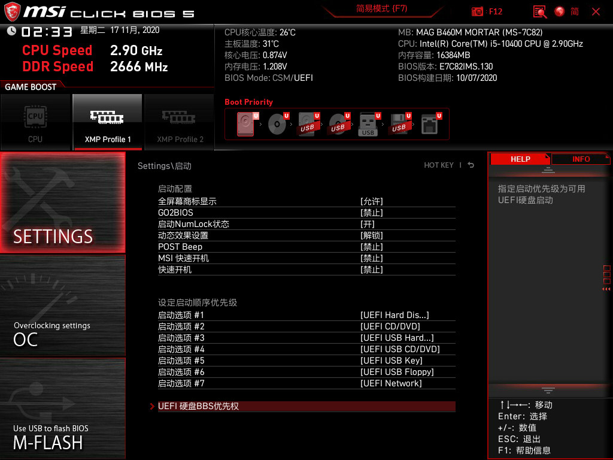
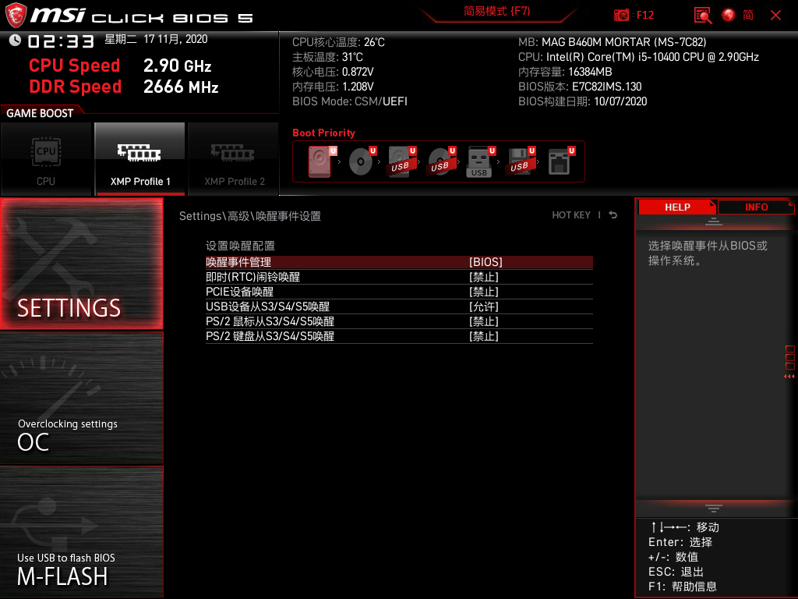
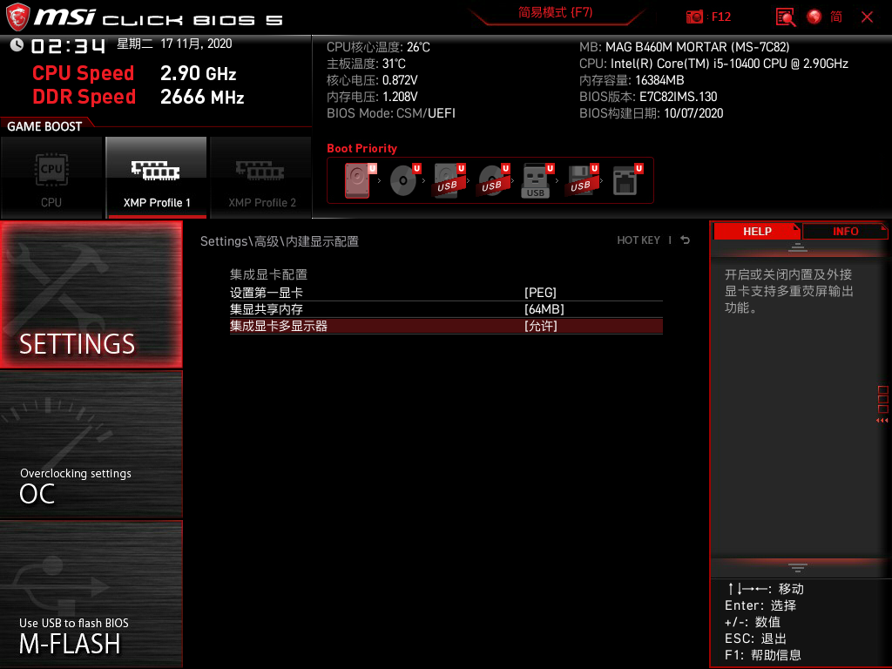
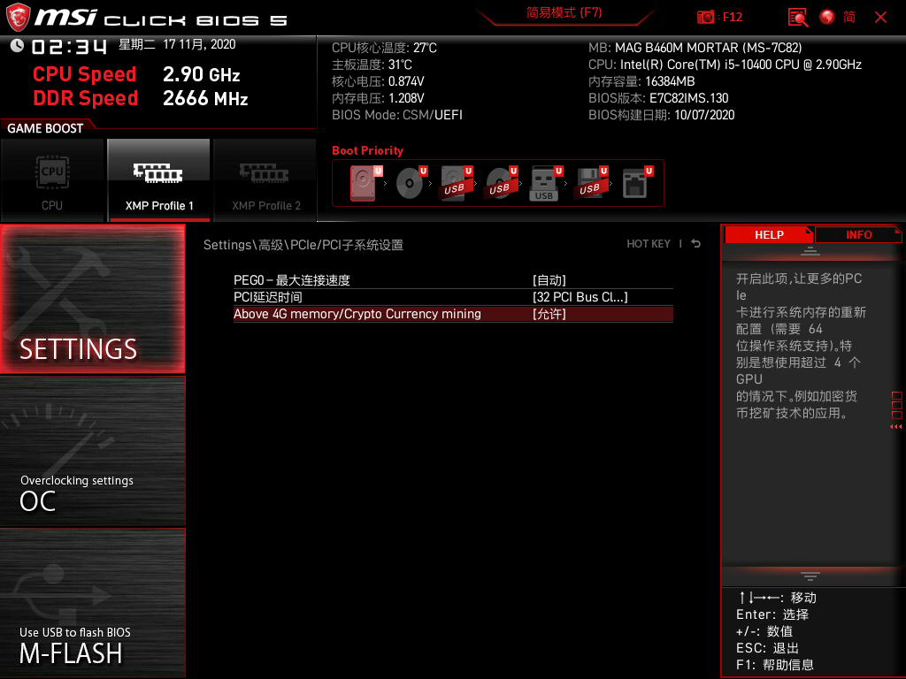
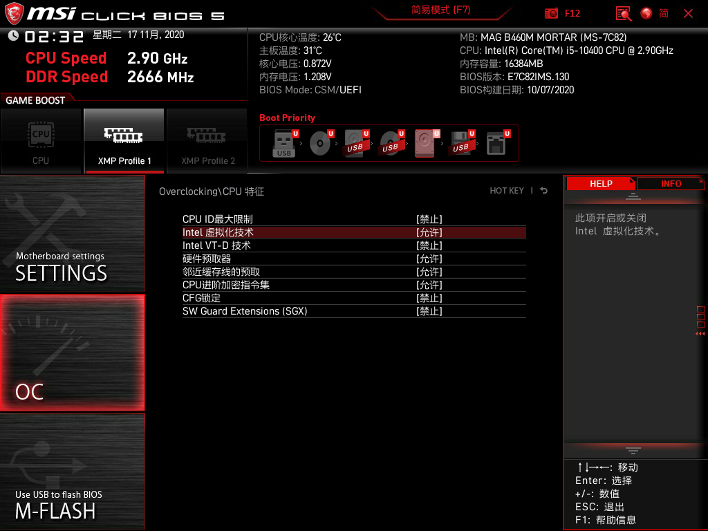
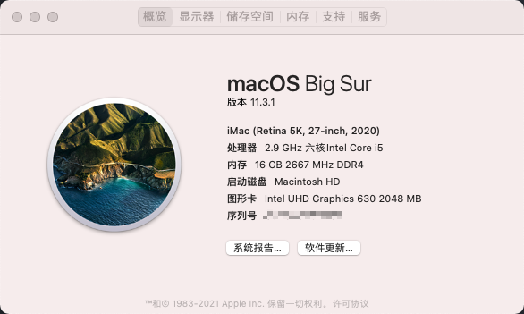

# Hackintosh-i510400-B460M-MORTAR-WIFI

## 声明
该EFI并不“完美”，仅供参考，追求完美的小伙伴谨慎使用。

## EFI 
因为我装的是双系统，所以EFI中有`windows`引导文件，使用前删除`Microsoft`文件夹

EFI都是在网上东拼西凑找来的，后期有时间考虑学习自己定制一个，毕竟现在的EFI还有很多地方不是很好。

> 参考EFI及资料
> 
> https://mp.weixin.qq.com/s/UNtxsMIaKISyH6uRNt0LzQ
> 
> https://github.com/cheneyxx/Hackintosh-10400-B460M-MORTAR
> 
> https://www.bilibili.com/video/BV1Lf4y1i7FV?from=search&seid=15517732188143082051
> 
> https://github.com/OpenIntelWireless/IntelBluetoothFirmware
> 
> https://github.com/OpenIntelWireless/itlwm
> 
> https://github.com/xzhih/one-key-hidpi

macOS version: 11.3.1 Big Sur

镜像：黑果小兵11.3.1镜像

引导方式：OC引导

## 硬件配置（价格仅供参考）
**购买时间：2021-6-1**
|硬件|型号|价格（京东）含购物券|
|------|------|------|
|主板|微星 B460M MORTAR WIFI|620|
|CPU|Intel i5 10400|1257|
|内存|金士顿骇客神条RGB灯条 8GB * 2 2666MHz|647|
|SSD <br /> 散热|铠侠 RC10 512GB * 2 <br /> 乔思伯CR-1000 白色|849|
|显卡|Intel UHD Graphics 630（CPU自带核显） |
|电源|振华LEADEX G 550|448|
|机箱|爱国者 M2 白色|146|
|显示器|AOC Q27U2D 27寸/2K|1692|
|网卡|板载AX200|
|总价格|---|5659|

## Bios设置







## 功能测试
- [x] 睡眠/唤醒
- [x] 核显硬件加速
- [x] 声卡输出
- [x] windows和mac时间不同步问题
  windows下管理员身份运行命令
  ```
  Reg add HKLM\SYSTEM\CurrentControlSet\Control\TimeZoneInformation /v RealTimeIsUniversal /t REG_DWORD /d 1
  ```

## 不稳定的功能
蓝牙和wifi偶尔不稳定
- [x] 蓝牙（不知是不是我蓝牙音箱只能记忆一台设备的问题，windows/mac只能连接一台，想要连接上必须在蓝牙中删除设备重新配对）
- [x] wifi
- [x] HIDPI开启后感觉效果不大，帧率反而有明显的下降，字体有一点模糊（可能是2k分辨率不太够？又或者换DP线效果更好）
  开启方案：https://github.com/xzhih/one-key-hidpi

### 关于本机



